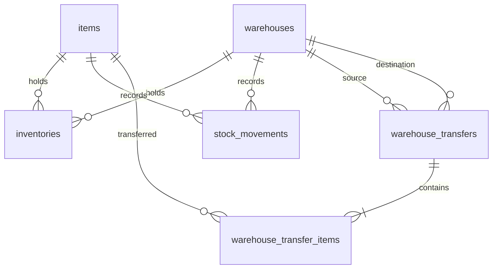

# [초안] 재고관리 모듈 DB 설계서 (Inventory Module Database Schema)

이 문서는 DDUK ERP 재고관리 모듈의 데이터베이스 스키마 및 테이블 명세서이다.

* **상태**: 초안 (Draft)
* **최종 수정일**: 2026-05-27

---

## 1. ER 다이어그램 (개념 구조)



---

## 2. 물리 테이블 명세

### 2.1. `inventories` (재고 마스터 테이블 - 컬럼 정합성 반영)
* **설명**: 창고별 품목의 실시간 재고 정보를 추적 관리한다. 실제 DB 스키마와 100% 동일하게 매핑하여 이중 컬럼 생성을 완벽 차단한다.
* **JPA Entity Mapping**: `com.dduk.entity.inventory.Inventory`

| 논리 컬럼명 | 물리 컬럼명 | 타입 | Null 여부 | 기본값 | 제약/설명 |
| --- | --- | --- | --- | --- | --- |
| ID | `id` | BIGINT | NOT NULL | AUTO_INCREMENT | PK |
| 품목 ID | `item_id` | BIGINT | NOT NULL | | FK (items.id) |
| 창고 ID | `warehouse_id` | BIGINT | NOT NULL | | FK (warehouses.id) |
| 위치코드 | `location` | VARCHAR(100) | NOT NULL | | 기본값은 창고코드 |
| 현재고수량 | `current_stock` | INT | NOT NULL | 0 | 실보유 재고량 (Entity quantity 필드와 매핑) |
| 예약재고수량 | `allocated_stock` | INT | NOT NULL | 0 | 주문/이동 등으로 대기중인 수량 (Entity allocatedQuantity 필드와 매핑) |
| 안전재고수량 | `safety_stock` | INT | NOT NULL | 0 | 발주 시점 기준값 |
| 이동평균단가 | `average_cost` | DECIMAL(19,4) | NOT NULL | 0.0000 | 총자산 가치 연산용 단가 |
| 재고자산가치 | `inventory_value` | DECIMAL(19,4) | NOT NULL | 0.0000 | `average_cost * current_stock` |
| 낙관적 락 버전 | `version` | BIGINT | NOT NULL | 0 | 동시성 처리용 버전 |
| 수정일시 | `updated_at` | DATETIME | NOT NULL | CURRENT_TIMESTAMP | |

---

### 2.2. `stock_movements` (재고 변동 이력 원장 테이블)
* **설명**: 발생한 모든 재고 거래 내역을 기록한다. 수정 및 삭제가 불가능한 Immutable Ledger 성격을 띤다.
* **JPA Entity Mapping**: `com.dduk.entity.inventory.StockMovement`

| 논리 컬럼명 | 물리 컬럼명 | 타입 | Null 여부 | 기본값 | 제약/설명 |
| --- | --- | --- | --- | --- | --- |
| ID | `id` | BIGINT | NOT NULL | AUTO_INCREMENT | PK |
| 품목 ID | `item_id` | BIGINT | NOT NULL | | FK (items.id) |
| 창고 ID | `warehouse_id` | BIGINT | NOT NULL | | FK (warehouses.id) |
| 거래 구분 | `movement_type` | VARCHAR(30) | NOT NULL | | INBOUND, OUTBOUND, ADJUSTMENT_IN, ADJUSTMENT_OUT, TRANSFER_IN, TRANSFER_OUT, RETURN_IN, RETURN_OUT |
| 거래 사유 | `movement_reason` | VARCHAR(50) | NOT NULL | | PURCHASE_RECEIVED, SALES_SHIPPED, TRANSFER, MANUAL_ADJUST |
| 참조번호 | `reference_no` | VARCHAR(50) | NOT NULL | | UK. 전표 번호 등 (예: TRF-IN-YYYYMMDD-XXXX) |
| 거래 수량 | `quantity` | INT | NOT NULL | | |
| 거래 단가 | `unit_cost` | DECIMAL(19,4) | NOT NULL | 0.0000 | |
| 거래 금액 | `total_amount` | DECIMAL(19,4) | NOT NULL | 0.0000 | |
| 변동 전 수량 | `before_quantity` | INT | NOT NULL | | 정합성 검사용 |
| 변동 후 수량 | `after_quantity` | INT | NOT NULL | | 정합성 검사용 |
| 참조 출처 타입 | `reference_type` | VARCHAR(50) | NULL | | PURCHASE_ORDER, WAREHOUSE_TRANSFER 등 |
| 참조 출처 ID | `reference_id` | VARCHAR(50) | NULL | | 각 참조 문서의 ID 또는 No |
| 생성일시 | `created_at` | DATETIME | NOT NULL | CURRENT_TIMESTAMP | |

---

### 2.3. `warehouse_transfers` (창고 이동 요청 테이블 - 신규)
* **설명**: 창고 간 재고 이동 워크플로우를 통제 및 관리하기 위한 테이블이다.
* **JPA Entity Mapping**: `com.dduk.entity.inventory.WarehouseTransfer`

```sql
CREATE TABLE IF NOT EXISTS warehouse_transfers (
    id BIGINT NOT NULL AUTO_INCREMENT,
    transfer_no VARCHAR(50) NOT NULL,
    source_warehouse_id BIGINT NOT NULL,
    target_warehouse_id BIGINT NOT NULL,
    status VARCHAR(30) NOT NULL DEFAULT 'PENDING',
    remarks VARCHAR(255) NULL,
    requested_by_id BIGINT NOT NULL,
    approved_by_id BIGINT NULL,
    created_at DATETIME NOT NULL DEFAULT CURRENT_TIMESTAMP,
    updated_at DATETIME NOT NULL DEFAULT CURRENT_TIMESTAMP ON UPDATE CURRENT_TIMESTAMP,
    approved_at DATETIME NULL,
    completed_at DATETIME NULL,
    PRIMARY KEY (id),
    UNIQUE KEY uk_warehouse_transfers_no (transfer_no),
    KEY idx_warehouse_transfers_status (status),
    CONSTRAINT fk_transfers_source_wh FOREIGN KEY (source_warehouse_id) REFERENCES warehouses (id),
    CONSTRAINT fk_transfers_target_wh FOREIGN KEY (target_warehouse_id) REFERENCES warehouses (id),
    CONSTRAINT fk_transfers_requested_by FOREIGN KEY (requested_by_id) REFERENCES members (id),
    CONSTRAINT fk_transfers_approved_by FOREIGN KEY (approved_by_id) REFERENCES members (id)
) ENGINE=InnoDB DEFAULT CHARSET=utf8mb4 COLLATE=utf8mb4_unicode_ci;
```

---

### 2.4. `warehouse_transfer_items` (창고 이동 상세 테이블 - 신규)
* **설명**: 각 창고 이동 건에 포함된 이동 품목 및 수량을 관리한다.
* **JPA Entity Mapping**: `com.dduk.entity.inventory.WarehouseTransferItem`

```sql
CREATE TABLE IF NOT EXISTS warehouse_transfer_items (
    id BIGINT NOT NULL AUTO_INCREMENT,
    transfer_id BIGINT NOT NULL,
    item_id BIGINT NOT NULL,
    quantity INT NOT NULL,
    PRIMARY KEY (id),
    KEY idx_transfer_items_transfer (transfer_id),
    CONSTRAINT chk_transfer_items_qty CHECK (quantity > 0),
    CONSTRAINT fk_transfer_items_transfer FOREIGN KEY (transfer_id) REFERENCES warehouse_transfers (id) ON DELETE CASCADE,
    CONSTRAINT fk_transfer_items_item FOREIGN KEY (item_id) REFERENCES items (id)
) ENGINE=InnoDB DEFAULT CHARSET=utf8mb4 COLLATE=utf8mb4_unicode_ci;
```

---

## 3. 정합성 및 안전 장치

### 3.1. 이동평균단가 정책
* **계산 방식**:
  $$\text{신규평균단가} = \frac{\text{기존재고금액} + \text{입고금액}}{\text{기존수량} + \text{입고수량}}$$
* **BigDecimal 연산 정책**:
  - Precision Scale: 소수점 `4`자리 고정
  - Rounding Mode: `RoundingMode.HALF_UP` (반올림)
  - `0 division check`: 입고량이 없거나 분모가 0이 되는 연산 발생 시 무조건 연산을 건너뛰고 기존 단가를 유지하거나 오류 방어 로직 작동.
* **음수 재고 방지**: 모든 재고 수량과 가치(`current_stock`, `inventory_value`)는 음수(Negative value)를 가질 수 없으며, 감산 중 음수 도달 시 트랜잭션 전면 롤백 발생.

### 3.2. 이중 재검증 및 상태 보호
1. **완료 시점 재검증**: 이동 승인(`APPROVED`) 상태에서 이동 완료(`COMPLETED`)로 넘어갈 때, 출발 창고의 현재 재고 수량을 재조회하여 실제 이동할 수량이 현재고보다 작다면 즉시 예외(`IllegalStateException("재고 부족")`)를 유발합니다.
2. **멱등성(Idempotency) 보장**:
   - `completeTransfer()` 호출 시 상태가 `COMPLETED`로 확인되면 멱등적으로 비즈니스 수행 없이 성공 반환합니다.
   - `transfer_no`를 기반으로 동일 전표에 대한 중복 movement 생성을 방지합니다.
3. **동시성 제어**: `inventories` 테이블의 `version` 컬럼을 활용한 `@Version` 낙관적 락(Optimistic Lock)을 완벽 도입하여 동일 시점에 대규모 트랜잭션이 충돌해도 재고 불일치가 발생하지 않도록 제어합니다.
4. **승인 연쇄 트랜잭션 보장**: 단일 `@Transactional(rollbackFor = Exception.class)` 내부에서 모든 가감과 이력 적재를 동기식으로 일괄 처리합니다.
