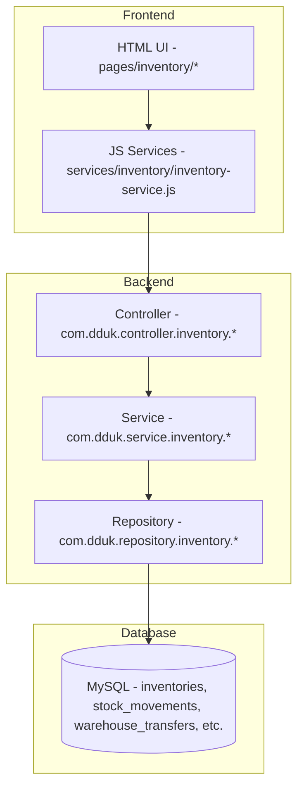

# [초안] 재고관리 모듈 구현 계획서 (Inventory Module Implementation Plan)

이 문서는 DDUK ERP의 재고관리 모듈을 안정적이고 확장성 있게 구축하기 위한 구현 계획서이다.

* **작성자**: Antigravity AI
* **상태**: 초안 (Draft)
* **최종 수정일**: 2026-05-27

---

## 1. 개요 및 목표

현재 회계관리 모듈의 완전 마무리 전 단계로, 우선순위가 높은 **재고관리 모듈**을 우선 구축한다. 재고관리 모듈은 현업에서 실시간으로 품목별 재고 현황을 파악하고, 모든 재고 변동(입고, 출고, 창고 간 이동)을 엄격한 트랜잭션과 승인 절차를 기반으로 기록하고 통제하여 데이터 정합성과 투명성을 제공하는 것을 목표로 한다.

### 핵심 4대 기능
1. **실시간 재고조회**: 품목별, 창고별 실시간 재고(현재고, 예약재고, 가용재고, 안전재고) 조회.
2. **입출고 이력 관리 (원장)**: 모든 입출고 트랜잭션의 엄격한 추적 및 Audit Log 기록.
3. **창고 이동 승인 프로세스**: 창고 간 재고 이동의 요청-승인-완료-취소 워크플로우 통제 및 예약재고 제어.
4. **재고관리 대시보드**: 운영진 및 담당자가 재고 자산 가치 및 부족 재고 상황을 한눈에 파악할 수 있는 KPI 및 시각화 제공.

---

## 2. 모듈 구성 및 아키텍처

DDUK ERP의 기존 3-Layer Layered Architecture(Controller - Service - Repository) 및 프론트엔드 Vanilla JS 서비스 패턴을 동일하게 계승한다.

### 도메인 분리 및 Read Model 분리 (CQRS-lite)
* 백엔드 계층화 구조에 따라 `com.dduk.[layer].inventory` 하위에 패키지를 구성한다.
* 대시보드 통계 및 차트 조회의 성능 최적화와 결합도 감소를 위해 `InventoryDashboardResponseDto` 및 `DashboardStatsProjection` Read Model을 도메인과 확실히 분리하여 설계한다.

---

## 3. 기능별 상세 구현 범위

### 3.1. 재고조회 기능
* **현재고 및 가용재고**: 가용재고 = 현재고 - 예약재고(allocated_stock).
* **안전재고(Safety Stock) 경고**: 현재고가 안전재고 이하로 하회하는 경우 대시보드 및 리스트에서 경고 배지 표기.
* **창고별/품목별 필터 및 검색**: 품목코드/명 검색 지원.
* **엑셀/CSV 다운로드**: 프론트엔드 단에서 테이블 데이터를 다운로드하는 범용 구조 준비.

### 3.2. 입출고 이력 관리
* **재고 변동 원장(`stock_movements`)**: 모든 재고 증감은 이 원장에 기록되며 절대 수정/Soft-delete 되지 않는 불변(Immutable) 원장 성격을 띤다.
* **거래 유형 세분화 (StockMovementType 확장)**: 
  - `INBOUND` (입고), `OUTBOUND` (출고)
  - `ADJUSTMENT_IN` (조정 입고), `ADJUSTMENT_OUT` (조정 출고)
  - `TRANSFER_IN` (창고 이동 입고), `TRANSFER_OUT` (창고 이동 출고)
  - `RETURN_IN` (반품 입고), `RETURN_OUT` (반품 출고)
* **안전 검증**: 출고(OUTBOUND) 및 창고이동 요청 시 가용 재고 부족 검증 필수, 예외 발생 시 전원 Rollback 처리.

### 3.3. 창고 이동 승인 프로세스 (핵심 신규 구현)
* **단순 즉시 이동에서 '승인 워크플로우'로 전환**:
  1. **요청 (REQUESTED/PENDING)**: 출발 창고에서 품목 및 수량을 선택하여 요청. 출발 창고의 `allocatedStock`이 증가하고 가용재고가 잠김.
  2. **승인 (APPROVED)**: 요청이 승인되어 이동 중인 상태로 전환.
  3. **완료 (COMPLETED)**: 도착 창고에서 수령 및 검수 완료 처리. 실제 재고 증감이 발생하고 `stock_movements`에 기록됨. 출발 창고의 `currentStock` 및 `allocatedStock` 차감, 도착 창고의 `currentStock` 증가.
  4. **취소/반려 (CANCELLED)**: 이동 요청을 취소하거나 반려. 출발 창고의 `allocatedStock` 잠금이 해제됨.
* **완료 시점 재검증 도입**: 승인 이후 실제 완료(COMPLETE) 처리 시점 사이에 다른 임의 출고 등으로 재고가 변동될 수 있으므로, 완료 시점에 출발 창고의 현재고를 재검색하여 부족 시 즉시 예외(`IllegalStateException`)를 발생시킵니다.
* **멱등성(Idempotency) 및 상태 보호**:
  - 이미 `COMPLETED` 상태인 건에 대해서는 멱등적으로 처리를 즉시 무시하여 중복 반영을 방지합니다.
  - 비정상적인 상태 전이(예: CANCEL 후 APPROVE, APPROVED 없이 COMPLETE 등)는 강한 상태 머신 보호 코드로 원천 차단합니다.
* **원자성 보장**:
  - 출발 창고 현재고/예약재고 차감, 도착 창고 가산, `TRANSFER_OUT` 및 `TRANSFER_IN` 원장 생성, 상태 갱신은 반드시 단일 `@Transactional` 내부에서 완전히 묶여 원자적으로 실행됩니다.

### 3.4. 재고관리 대시보드
* **KPI 카드**: 총 품목 수, 총 재고 가치(평균단가 * 현재고의 총합), 부족 재고 수, 오늘 입/출고 수량, 이동 대기 건수.
* **시각화 위젯**: 창고별 재고 분포(보유자산액 및 수량), 최근 입출고 5건 목록, 부족 재고 TOP 품목, 승인 대기 중인 이동 건 목록.

---

## 4. 이동평균단가 계산 정책

* **갱신 공식**:
  $$\text{신규평균단가} = \frac{\text{기존재고금액} + \text{입고금액}}{\text{기존수량} + \text{입고수량}}$$
* **BigDecimal 연산 정책**:
  - 나눗셈 연산 시 precision scale은 `4`자리로 제한합니다.
  - Rounding Mode는 `RoundingMode.HALF_UP` (사사오입 반올림) 방식을 사용합니다.
  - 신규 입고로 분모(`기존수량 + 입고수량`)가 `0`이 되는 상황을 방지하기 위한 `0 division check` 방어 로직을 구현합니다.
* **음수 재고 금지**: 모든 재고 수량과 가치는 음수(Negative value)를 가질 수 없으며, 감산 중 음수 도달 시 즉시 트랜잭션 예외를 일으킵니다.
