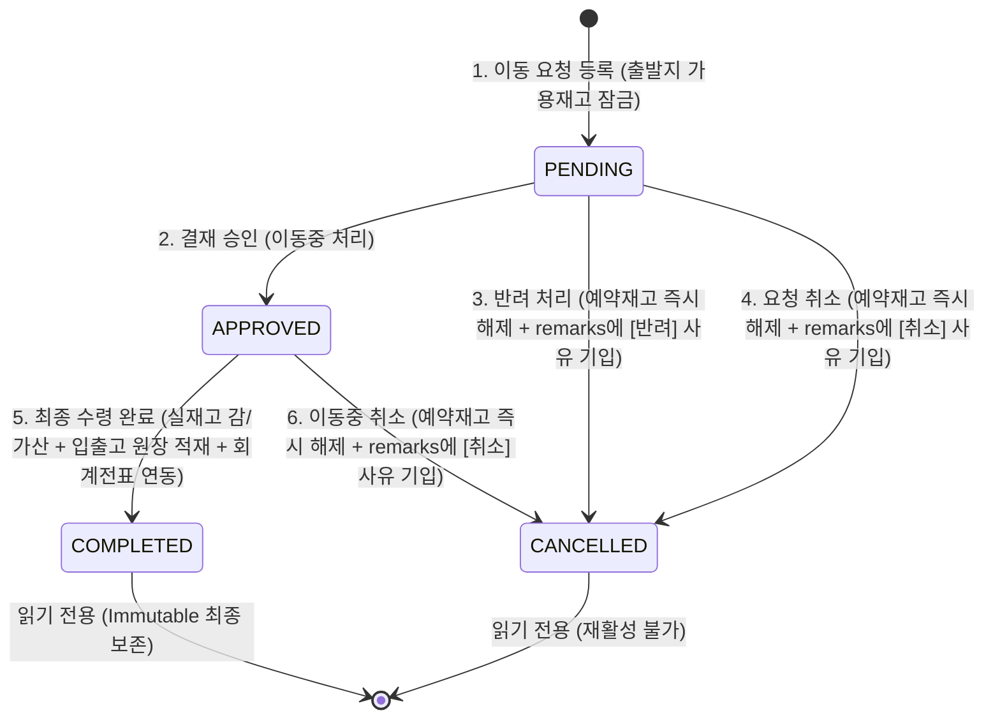
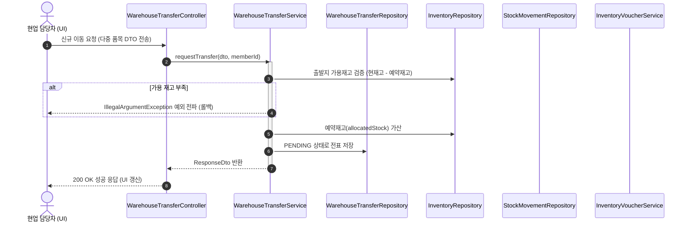

# 창고 이동 승인 결재 워크플로우 명세서 (Warehouse Transfer Workflow)

본 문서는 DDUK ERP 재고관리 모듈의 핵심인 **창고 간 재고 이동 승인 워크플로우(Warehouse Transfer Workflow)**의 전 과정을 설명하는 공식 문서이다. 
특히, 본 모듈은 **Zero DB Modification(DB 스키마 무변경)** 정책 하에 기존 인프라를 100% 재활용하여 구현되었다.

* **최종 수정일**: 2026-05-28
* **적용 사양**: 다중 품목 신청, 동적 사유 파싱, 프론트/백엔드 이중 상태 전이 검증

---

## 1. 상태 전이 다이어그램 (State Machine Diagram)

창고 이동은 엄격한 상태 관리를 거쳐 진행되며, 불허 상태 전이 시도 시 백엔드 및 프론트에서 원천 예외 차단된다.

---

## 2. 시퀀스 다이어그램 (Sequence Diagram)

이동 요청 등록부터 도착지 최종 수령 및 전표 연동에 이르는 원자적 트랜잭션 흐름이다.

---

## 3. Zero DB 사유 적재 및 동적 타임라인 유추

### 3.1. 반려/취소 사유 바인딩 기법
DB 컬럼을 추가하지 않고, **`remarks` (VARCHAR 255)** 필드 하나를 재활용하여 다음과 같이 구조화해 저장한다.
* **반려 시**: `remarks = "[반려] 사유: 요청 수량이 가용 범위를 초과하여 기각합니다."`
* **취소 시**: `remarks = "[취소] 사유: 타 부서 긴급 공급으로 인한 중복 요청 취소."`

### 3.2. 동적 Audit Timeline 유출 공식
테이블 로그를 따로 쌓지 않고, 마스터 데이터의 시간 필드를 조합하여 UI 단에서 다음과 같이 감사 타임라인을 파싱 렌더링한다.
1. `createdAt` 존재 ➔ `[요청 완료] (createdAt)`
2. `approvedAt` 존재 ➔ `[이동 승인] (approvedAt) - 승인자: approvedByName`
3. `status == 'COMPLETED'` ➔ `[최종 완료] (completedAt) - 수령 검수 완료`
4. `status == 'CANCELLED' && remarks.contains("[반려]")` ➔ `[결재 반려] (updatedAt) - 반려자: approvedByName / 사유: remarks 내용`
5. `status == 'CANCELLED' && remarks.contains("[취소]")` ➔ `[요청 취소] (updatedAt) - 취소자: requestedByName / 사유: remarks 내용`

---

## 4. 트랜잭션 롤백 및 정합성 매트릭스 (Validation Matrix)

| 상태 전이 시도 | 유효성 검증 조건 | 실패 시 예외 | 처리 결과 (롤백 조건) |
|---|---|---|---|
| **PENDING ➔ APPROVED** | 현재 상태가 `PENDING`인지 검사 | `IllegalStateException` | 불허 상태 전환 시 전체 롤백 |
| **PENDING ➔ CANCELLED** | 현재 상태가 `PENDING`인지 검사 | `IllegalStateException` | 예약재고(`allocatedStock`) 감산 해제 실패 시 롤백 |
| **APPROVED ➔ COMPLETED** | 1. 현재 상태가 `APPROVED`인지 검사 2. 회계 당월 마감 여부 검증 3. 출발지 실재고 부족 검증 | `IllegalStateException` `MonthlyClosingException` | 1. 출발지 재고 감산 & 도착지 재고 가산 및 단가 산출 2. 입출고 원장(`StockMovement`) 2건 적재 3. 회계 자동 전표(`Voucher`) 생성 실패 시 **전체 롤백** |
